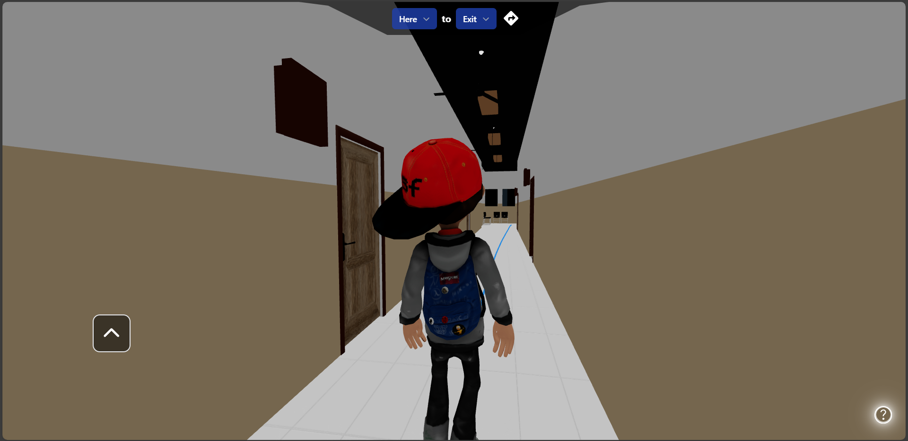

# Campus Navigator

Campus Navigator is a project that aims to provide a user-friendly navigation system for campuses. It helps users find their way around the campus by providing detailed directions for various locations.

This is just a small prototype of the actual project.

## Demo

## Steps to Run Locally

#### Clone the repository
`git clone https://github.com/Darshan2003/Campus-Navigator.git`

#### Run the project
`npm run start`
